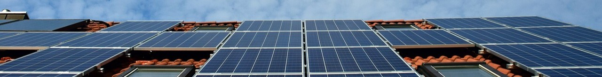

# Predict energy behavior of prosumers

The repository contains a solution to predict the energy behavior of prosumers in order to minimize the energy imbalance. Prosumers are individuals who both consume and produce energy.

---
## Problem description

The energy imbalance is a state where the amounts of energy production and consumption differ. The negative effects of energy imbalace are increased operational costs, potential energy grid instability, and inefficient use of energy resources.
By predicting the energy behavior of prosumers the energy imbalance could be decreased, thus lowering the operational costs and stabilizing the grid system.

The problem was initially presented by Eesti Energia on [Kaggle](https://www.kaggle.com/competitions/predict-energy-behavior-of-prosumers/overview).

## Quick start

1. Clone this repository using `git clone https://github.com/bonskotti/predict-energy-behavior.git`
2. Install requirements using `pip install -r requirements.txt`
3. Run `jupyter-lab predict-energy-behavior-of-prosumers-predictions.ipynb`

## Data used

1. prosumer.csv - Prosumer data
2. gas_prices.csv - Gas price data
3. client.csv - Energy company client data
4. electricity_prices.csv - Electricity price data
5. weather_forecast.csv - Weather forecast data
6. weather_history.csv - Weather history data
7. weather_station_to_county_mapping.csv - Weather station data
8. county_id_to_name_map.json - County data

All data was provided by Eesti Energia.
---
   

